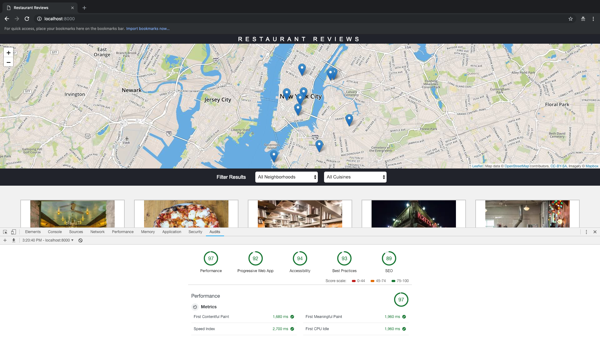

# Mobile Web Specialist Certification Course
---
#### _Three Stage Course Material Project - Restaurant Reviews_

## Project Overview: Stage 2

For the **Restaurant Reviews** projects, you will incrementally convert a static webpage to a mobile-ready web application. In **Stage Two**, you will take the responsive, accessible design you built in **Stage One** and connect it to an external server. You’ll begin by using asynchronous JavaScript to request JSON data from the server. You’ll store data received from the server in an offline database using IndexedDB, which will create an app shell architecture. Finally, you’ll work to optimize your site to meet performance benchmarks, which you’ll test using [Lighthouse](https://developers.google.com/web/tools/lighthouse/).

### Specification
You will be provided code for a Node development server and a README for getting the server up and running locally on your computer. The README will also contain the API you will need to make JSON requests to the server. Once you have the server up, you will begin the work of improving your **Stage One** project code.

The core functionality of the application will not change for this stage. Only the source of the data will change. You will use the `fetch()` API to make requests to the server to populate the content of your Restaurant Reviews app.

### Requirements
**Use server data instead of local memory**
In the first version of the application, all of the data for the restaurants was stored in the local application. You will need to change this behavior so that you are pulling all of your data from the server instead, and using the response data to generate the restaurant information on the main page and the detail page.

**Use IndexedDB to cache JSON responses**
In order to maintain offline use with the development server you will need to update the service worker to store the JSON received by your requests using the IndexedDB API. As with Stage One, any page that has been visited by the user should be available offline, with data pulled from the shell database.

**Meet the minimum performance requirements**
Once you have your app working with the server and working in offline mode, you’ll need to measure your site performance using Lighthouse.

Lighthouse measures performance in four areas, but your review will focus on three:

- **Progressive Web App** score should be at 90 or better.
- **Performance** score should be at **70** or better.
- **Accessibility** score should be at 90 or better.
You can audit your site's performance with Lighthouse by using the Audit tab of Chrome Dev Tools.

### Steps to complete
1. Fork and clone the [server repository](https://github.com/udacity/mws-restaurant-stage-2). You’ll use this development server to develop your project code.
2. Continue with your **Stage one**, change the data source for your restaurant requests to pull JSON from the server, parse the response and use the response to generate the site UI.
3. Cache the JSON responses for offline use by using the IndexedDB API.
4. Follow the recommendations provided by Lighthouse to achieve the required performance targets.
5. Submit your project code for review.

